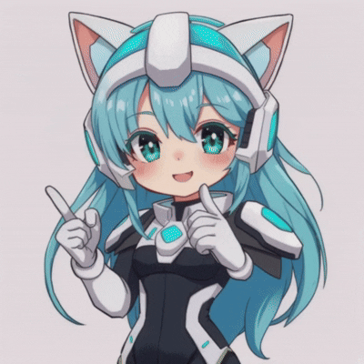

# Zero-chan 🎌

**Assistante vocale manga overlay** — Avatar animé + Whisper local + NVIDIA Nemotron (cloud) + TTS pré-enregistré



---

## ✨ Fonctionnalités

| Fonction | Techno |
|----------|--------|
| **Reconnaissance vocale (STT)** | `faster-whisper` base (local, CPU, int8) |
| **LLM Conversation** | `nvidia/nemotron-mini-4b-instruct` via NVIDIA NIM API (gratuit, ~100-200 tok/s) |
| **Synthèse vocale (TTS)** | WAV pré-enregistrés (clone vocal Qwen3-TTS, style anime JP → texte FR) |
| **Actions système** | YouTube, Terminal, LibreOffice, Gmail, Spotify/YouTube Music, Discord, Navigateur, VS Code |
| **Émotions** | 10+ émotions détectées (love, happy, excited, sad, confused, thinking, blush, proud, cute, surprised) |
| **Interface** | PyQt6 overlay frameless, always-on-top, GIF animé, bulle chat, barre de saisie |
| **Hotkey globale** | `Ctrl+Shift+Z` (via `xbindkeys`) |
| **Entrée texte** | Barre de chat intégrée |

---

## 🚀 Installation

### Prérequis
- Linux (testé Ubuntu/Debian/Arch)
- Python 3.10+
- PipeWire (`pw-play`) pour l'audio
- `xbindkeys` pour le hotkey global
- Microphone fonctionnel

### 1. Cloner & installer
```bash
cd /home/k00/Bureau/zerochan
python3 -m venv venv
source venv/bin/activate
pip install -r requirements.txt
```

### 2. Dépendances système
```bash
# Ubuntu/Debian
sudo apt install python3-venv portaudio19-dev libportaudio2 xbindkeys

# Arch
sudo pacman -S python portaudio xbindkeys
```

### 3. Clé API NVIDIA (gratuite)
1. Va sur **[build.nvidia.com](https://build.nvidia.com)**
2. Connecte-toi → **Get API Key** → Génère une clé
3. Exporte-la :
```bash
export NVIDIA_API_KEY="nvapi-TA_CLE_ICI"
```
*(Ajoute au `~/.bashrc` ou `~/.zshrc` pour persistance)*

### 4. Fichiers audio requis
Le dossier `audio_zerochan/` doit contenir les WAV organisés ainsi :
```
audio_zerochan/
├── action/        # youtube_open, terminal_open, spotify_open, etc.
├── emotions/      # happy, sad, excited, love, thinking, etc.
├── errors/        # error, not_found, cancelled, confirm, sorry, thanks
├── greetings/     # hello, hey, bye, good_morning, good_night, welcome_back
├── music/         # (optionnel)
└── system/        # startup, listening, processing, shutdown, volume_*
```
> Les WAV fournis sont générés via **Qwen3-TTS (voice cloning)** sur HF Space `wordercom-qwen3-tts`.

---

## ▶️ Lancement

```bash
cd /home/k00/Bureau/zerochan
export NVIDIA_API_KEY="nvapi-TA_CLE_ICI"
python3 zerochan.py
```

### Contrôles
| Action | Raccourci |
|--------|-----------|
| **Parler (micro)** | `Ctrl+Shift+Z` (maintenu 5s max) |
| **Taper un message** | Clic dans la barre → texte → `Entrée` ou `✨` |
| **Micro bouton** | Clic sur `🎤` dans l'UI |
| **Quitter** | Fermer la fenêtre ou `Ctrl+C` dans le terminal |

---

## 🏗️ Architecture

```
zerochan.py           # App principale (PyQt6, hotkey, pipeline audio)
zerobrain_nvidia.py   # Cerveau : Whisper (STT) + NVIDIA Nemotron (LLM) + Actions/Émotions
audio_zerochan/       # WAV TTS organisés par catégorie
image.gif             # Avatar animé (GIF multi-frames)
venv/                 # Environnement Python isolé
```

### Pipeline vocal
```
Micro (16kHz) → Whisper (local) → Texte
    ↓
Nemotron-mini-4B (NVIDIA NIM cloud) → Réponse + Détection action/émotion
    ↓
Exécution action (webbrowser/subprocess) → WAV contextuel (pw-play)
    ↓
Affichage bulle + GIF visualizer
```

---

## ⚙️ Configuration

### Modèle LLM (dans `zerobrain_nvidia.py`)
```python
NVIDIA_MODEL = "nvidia/nemotron-mini-4b-instruct"  # Rapide, 4B
# Alternatives gratuites :
# "nvidia/nvidia-nemotron-nano-9b-v2"   # 9B, plus récent
# "meta/llama-3.1-8b-instruct"          # Standard
# "nv-mistralai/mistral-nemo-12b-instruct"  # 12B, excellent FR
```

### Whisper (dans `zerobrain_nvidia.py`)
```python
WHISPER_MODEL = "base"      # tiny, base, small, medium, large-v3
WHISPER_DEVICE = "cpu"      # ou "cuda" si GPU dispo
WHISPER_COMPUTE = "int8"    # int8, int8_float16, float16, float32
```

### Hotkey (dans `zerochan.py`)
```python
# Modifie la ligne xbindkeys :
f'"/usr/bin/touch {trigger_path}"',
"    Ctrl+Shift+Z",   # ← Change ici (ex: Ctrl+Alt+Z)
```

---

## 🎤 Générer ses propres WAV (optionnel)

```bash
# Nécessite gradio_client + audio de référence
pip install gradio_client
python3 generate_wavs.py
```
> Utilise le Space HF `wordercom-qwen3-tts` pour du voice cloning japonais→français.

---

## 🐛 Dépannage

| Problème | Solution |
|----------|----------|
| `NVIDIA_API_KEY non définie` | `export NVIDIA_API_KEY="nvapi-..."` dans le **même terminal** |
| `pw-play: not found` | `sudo apt install pipewire-audio-client-libraries` |
| `xbindkeys` ne marche pas | `pkill xbindkeys && xbindkeys` + vérifie `~/.xbindkeysrc` |
| Micro muet | `pavucontrol` → onglet "Entrée" → bon device + volume |
| Whisper lent | Réduis `WHISPER_MODEL="tiny"` ou passe `device="cuda"` |
| GIF non animé | Vérifie `n_frames > 1` avec PIL |

---

## 📦 Dépendances Python (`requirements.txt`)

```txt
faster-whisper
openai
numpy
sounddevice
PyQt6
Pillow
```

---

## 📄 Licence

**MIT License** — voir [LICENSE](LICENSE)

---

## 🙏 Crédits

- **NVIDIA** — Nemotron models & NIM API gratuite
- **faster-whisper** — STT local performant
- **Qwen3-TTS** — Voice cloning (HF Space `wordercom-qwen3-tts`)
- **PyQt6** — GUI overlay
- **Phi-3 / Nemotron** — Modèles de base

---

## 💡 Idées d'amélioration

- [ ] Support multi-langues (Whisper `language=None` auto-détect)
- [ ] Streaming LLM (tokens progressifs dans la bulle)
- [ ] TTS local (piper, kokoro, bark) pour zéro cloud
- [ ] Plugins d'actions (YAML/JSON) sans modifier le code
- [ ] Mode "always listening" avec VAD (Silero)
- [ ] OverlayWayland (wlr-layer-shell) pour Hyprland/Sway

---

**Fait avec ❤️ pour les fans d'anime & de metal** 🤘